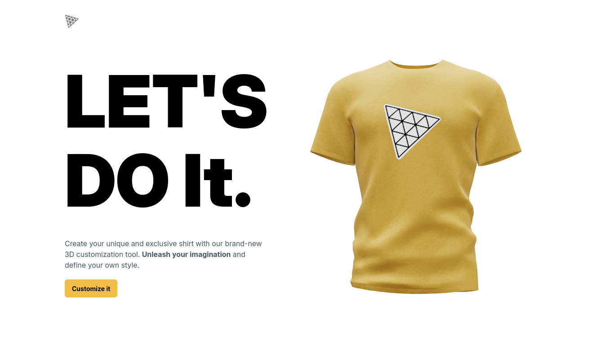

<h1>
  
  Meta Merch — AI Powered 3D T‑Shirt Customizer
</h1>


[](./LICENSE)


> A modern **AI‑powered 3D merchandise customization platform** that allows users to design T‑shirts in real time using **Three.js**, **React**, and **OpenAI DALL·E**.

---

## ✨ Overview

**Meta Merch** is a full‑stack web application that enables users to:
- Interactively customize a 3D T‑shirt model
- Apply colors, logos, and full textures
- Generate AI‑based designs using text prompts
- Export the final design as an image

The project combines **WebGL‑based 3D rendering** on the frontend with an **AI image generation backend**.

---

## 🖥️ Preview



---

## 📦 Tech Stack

### Frontend
- Vite 7
- React 19
- Three.js
- @react-three/fiber
- @react-three/drei
- TailwindCSS 4
- Valtio (state management)
- Framer Motion‑based animations

### Backend
- Node.js
- Express 5
- OpenAI API (DALL·E)
- CORS
- dotenv

### Developer Tools
- ESLint 9
- Prettier
- Nodemon

---

## 📁 Folder Structure

```bash
.
├── client
│   ├── public
│   ├── src
│   │   ├── assets
│   │   ├── canvas
│   │   ├── components
│   │   │   └── ui
│   │   ├── config
│   │   ├── pages
│   │   ├── store
│   │   ├── App.jsx
│   │   ├── main.jsx
│   │   └── index.css
│   ├── vite.config.js
│   └── package.json
│
├── server
│   ├── routes
│   │   └── dalle.route.js
│   ├── index.js
│   └── package.json
│
├── README.md
└── LICENSE
```

---

## ⚙️ Environment Variables

### Server (`server/.env`)
```env
OPENAI_API_KEY=your_openai_api_key
```

### Client (`client/.env`)
```env
VITE_API_URL=http://localhost:8080/api/v1/dalle
```

---

## 🛠️ Getting Started

### Clone the Repository
```bash
git clone https://github.com/grep-many/meta-merch.git
cd meta-merch
```

### Install Dependencies

#### Client
```bash
cd client
npm install
npm run dev
```

#### Server
```bash
cd server
npm install
npm run dev
```

---

## 🚀 Features

- Real‑time 3D T‑shirt rendering
- Color & texture customization
- Logo and full‑surface decals
- AI‑generated designs via text prompts
- Download customized designs as images
- Smooth UI animations and transitions
- Clean modular architecture

---

## 🔧 Configuration

Edit frontend config:

```js
// client/src/config/config.js
const config = {
  development: {
    backendUrl: "http://localhost:8080/api/v1/dalle",
  },
  production: {
    backendUrl: import.meta.env.VITE_API_URL,
  },
};

export default config;
```

---

## 🪪 License

This project is licensed under the [](./LICENSE).
